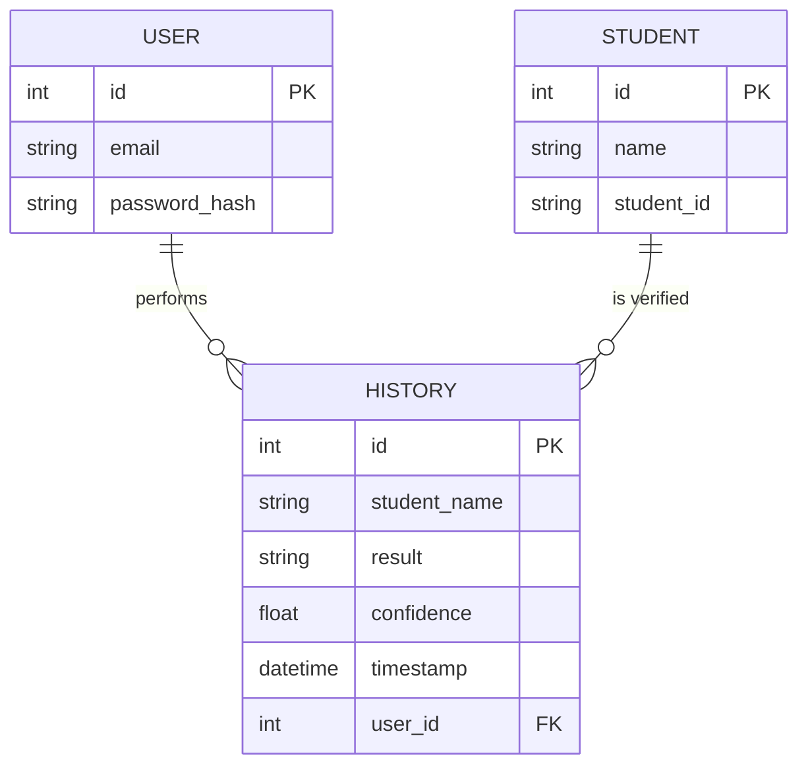

# Project Upgrade: Professional-Grade Signature Verification System

This plan outlines the steps to upgrade the current Signature Verification System with authentication, a database, and an enhanced user experience.

## 1. Core Objectives
- **Authentication**: Add Secure User Registration and Login.
- **Data Persistence**: Implement a SQLite database using SQLAlchemy for Users, Students, and Verification History.
- **Security**: Use password hashing (Bcrypt/Werkzeug) and session-based protection.
- **Premium UI**: Enhance the frontend with a modern, high-tech aesthetic and interactive components.

## 2. Technical Stack Expansion
- **Backend**: Flask
- **Auth**: `Flask-Login`
- **Database**: `Flask-SQLAlchemy` (SQLite)
- **Security**: `werkzeug.security`
- **Design**: Vanilla CSS (Modern CSS properties, Glassmorphism)

## 3. Implementation Roadmap

### Phase 1: Environment & Database Setup
- [ ] Install new dependencies (`Flask-Login`, `Flask-SQLAlchemy`).
- [ ] Create `models.py` to define:
    - **User**: For authentication (email/password).
    - **Student**: For managing signature references.
    - **History**: For logging verification attempts.

### Phase 2: Authentication System
- [ ] Create Login and Registration forms/templates.
- [ ] Implement Register and Login backend routes.
- [ ] Protect sensitive routes (like `/verify` and `/history`) using `@login_required`.

### Phase 3: Enhanced Backend Logic
- [ ] Refactor `app.py` to use database-driven student management.
- [ ] Migrate local `history` list to DB records.
- [ ] Optimize signature comparison logic.

### Phase 4: UI/UX Overhaul
- [ ] Re-design the Navbar with auth states (Login/Logout buttons).
- [ ] Create a "Dashboard" view after login.
- [ ] Add smooth transitions and loading states for verification.

## 4. Proposed Database Schema

---
**Next Step**: I will begin by installing `Flask-SQLAlchemy` and `Flask-Login`, and setting up the database models.
